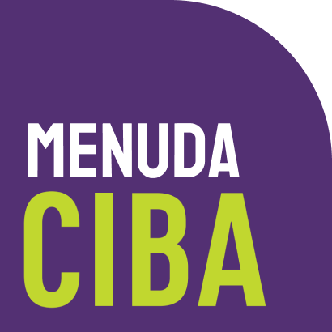
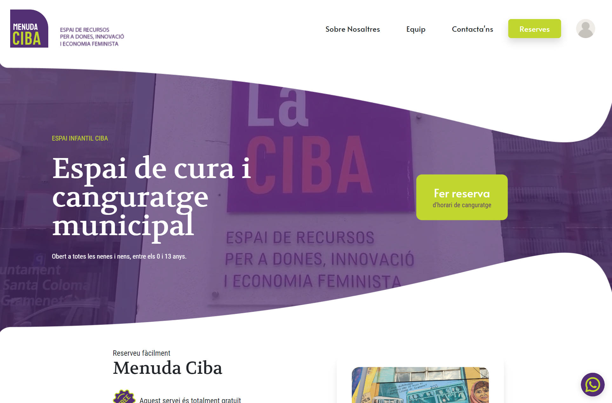
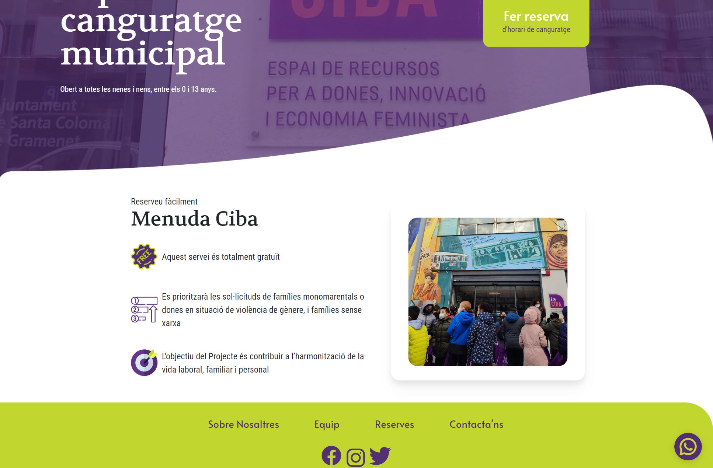
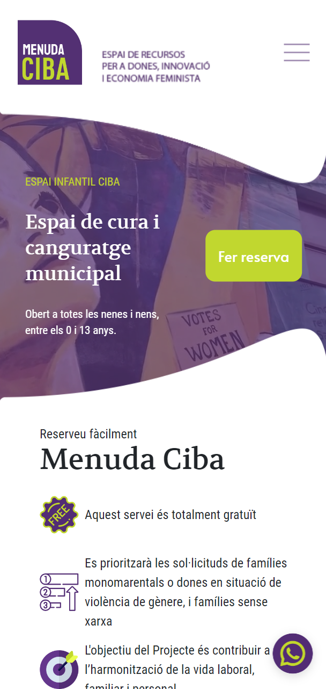
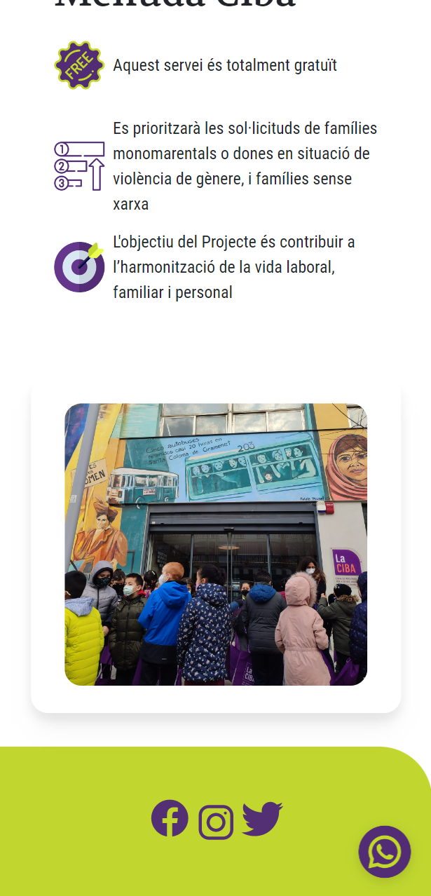
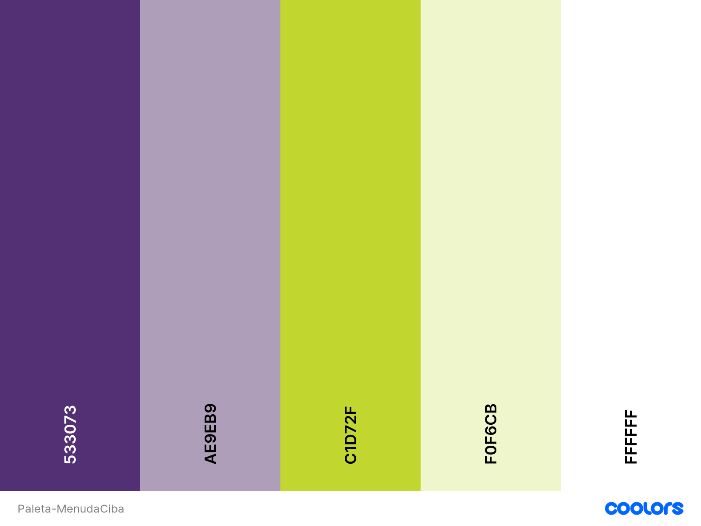

<div align="center">

  
  
  
 https://menudaciba.netlify.app/
 <br>
 https://menuda-ciba.vercel.app/
 <br>
 https://www.canva.com/design/DAFQBi4GXZ4/IW-M4zvClNHOMg5ZaBJ-Tw/view?utm_content=DAFQBi4GXZ4&utm_campaign=designshare&utm_medium=link2&utm_source=sharebutton 
  
  </div>

<br />

<!-- Table of Contents -->
# 💻 Table of Contents

- [About the Project](#about-the-project-⭐)
  * [Screenshots](#screenshots-📷)
  * [Tech Stack](#tech-stack-👾)
  * [Features](#features-🎯)
  * [Color Reference](#color-reference-🎨)
- [Getting Started](#getting-started-🧰)
  * [Run Locally](#run-locally-🏃‍♀️)
- [Authors](#authors-🙋‍♀️​)
- [Contributing](#contributing-👋 )
- [Contact](#contact-🤝)

  

<!-- About the Project -->
## About the Project ⭐ 
Menuda Ciba es una web de canguraje, para [La Ciba](https://laciba.gramenet.cat/es/) (centro de recursos para mujeres), ubicado en Santa Coloma de Gramenet, Barcelona.
Particularmente pensado para familias monomarentales en situación de violencia, proceso de formación, inserción laboral o necesidad de tiempo personal.
La finalidad de este proyecto es facilitar la reserva de citas para el canguraje de manera fácil y rápida.


<!-- Screenshots -->
### Screenshots 📷


<div> 
  
  <br>
  
</div>

<div style="display: flex; justify-content: space-around">
  
  <br>
  
</div>

<!-- TechStack -->
### Tech Stack 👾 

- ReactJs (18.2.0)
- Tailwind (3.2.1)
- Axios (1.0.0)
- React Router Dom (6.4.2)
- Firebase (9.12.1)
- EmailJS 
- CallBell 

<!-- Features -->
### Features  🎯

- Diseño responsive
- Contacto via Whatsapp
- Registro de reservas en base de datos
- Autenticación para el administrador y almacenaje en local storage
- Lista de reservas con vista protegida sólo para el administrador
- Envío de email de confirmación de reserva al usuario y al administrador
- Formulario de contacto funcional


<!-- Color Reference -->
### Color Reference 🎨 





<!-- Getting Started -->
## 	Getting Started 🧰 

<!-- Run Locally -->
### Run Locally 🏃‍♀️ 

Clona el proyecto

```bash
  git clone https://github.com/Niguisasola/menudaciba
```
Instala las dependencias

```bash
  npm i
```

Abre en el navegador

```bash
  npm start
```

## Authors 🙋‍♀️​

 [Florencia Lamanna](https://github.com/mflamanna)
 <br>
 [Nika Guisasola](https://github.com/Niguisasola)
 <br>
 [Laia Añó](https://github.com/laiaafernandez18)
 <br>
 [Rosa Becerra](https://github.com/RosaaBecerra)

<!-- Contributing -->
## Contributing 👋 

Sugerencias y contribuciones son siempre bienvenidas!

Mira en el apartado de contacto para más información.


<!-- Contact -->
## Contact 🤝 

Menuda Ciba - menudaciba@gmail.com
